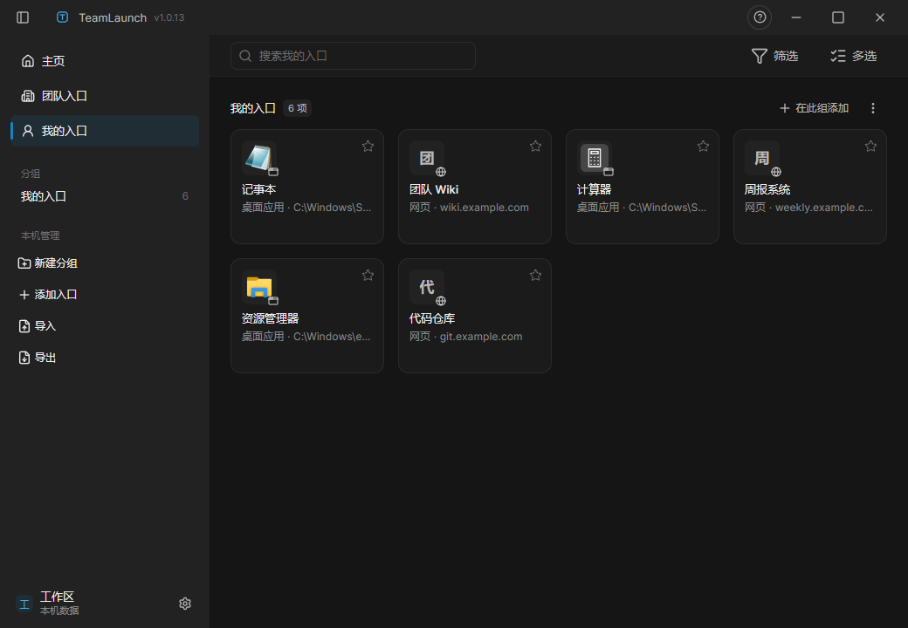

# TeamLaunch

**团队统一入口工具** —— 管理员维护一份入口清单，员工端自动同步，双击即可打开
（桌面应用 / 文件夹 / 内网网页），不再靠群聊里复制路径。

> **English**: TeamLaunch is a Windows desktop launcher for small teams. The admin
> maintains one shared list of entries (apps, folders, intranet pages); everyone
> else gets it synced automatically over the LAN and launches with a double click.
> No server to deploy — the admin's installed app **is** the server.



## 功能

- **团队入口 · 自动同步**：管理员编辑并发布，员工端开机即得；内嵌同步服务随管理员
  应用启动（端口 17890–17899 自动发现），员工机零配置、零部署。
- **跨机路径分层解析**：入口路径在本机不存在时，按"重新定位缓存 → App Paths 注册表 →
  开始菜单索引"自动找到真实程序启动，员工机盘符不同也能打开。
- **图标自动提取**：桌面应用/文件夹自动提取 Windows 图标；路径失效自动重新解析；
  网页入口可用内置表情选择器（57 个）手工配图。
- **多选连锁启动**：勾选多个入口按顺序启动（间隔可调），晨会开一套环境只需一次点击。
- **主页**：管理员发布的公告轮播（Markdown 渲染）+ 个人收藏汇总。
- **个人入口**：每个员工自己的私有入口清单，导入/导出随需。
- **可自定义快捷键**：应用内全部键位可改，冲突拒绝；全局快捷搜索窗口随叫随到。
- **应用内自动更新**：更新源即管理员机，员工端自动发现、后台下载、一键重启升级。
- **明暗双主题 + 主题色**：中性灰画布，8 预设主题色点缀；界面缩放 90–150%。

## 安装

1. 从 [Releases](../../releases/latest) 下载 `TeamLaunch-Setup-x.y.z.exe`。
2. Windows SmartScreen 会提示"已保护你的电脑"（安装包未做代码签名）：点
   **"更多信息" → "仍要运行"**。
3. **管理员机请右键"以管理员身份运行"**——防火墙入站规则必须在提权安装阶段创建，
   普通双击安装员工端将连不上。
4. 安装后打开 设置 → 管理员模式，设置口令即可开始添加入口。

详见 [`docs/DELIVERY.md`](docs/DELIVERY.md)（分发与安装、防火墙自检）。

## 角色速览

| | 管理员（分发者） | 员工 |
|---|---|---|
| 安装 | 管理员身份安装（建防火墙规则） | 正常安装 |
| 日常 | 编辑入口 → 发布；保持应用运行（托盘常驻） | 双击团队入口直接打开 |
| 网络 | 无需固定 IP，端口自动发现 | 无需知道管理员 IP |

## 从源码构建 / 开发

```bash
npm install          # postinstall 会自动给 electron-builder 打本机兼容补丁
npm run dist:win     # 构建渲染层/主进程 + 打 NSIS 安装包
npm run verify:all   # 全量门禁（渲染/架构/同步/打包依赖）
```

浏览器预览渲染层、自检门禁、目录约定的完整说明见 [`docs/DEVELOPMENT.md`](docs/DEVELOPMENT.md)；
参与贡献请读 [`CONTRIBUTING.md`](CONTRIBUTING.md)。

## 文档

| 文档 | 内容 |
|---|---|
| [`docs/PRD.md`](docs/PRD.md) | 产品需求（P0-01~12） |
| [`docs/ARCHITECTURE.md`](docs/ARCHITECTURE.md) | 架构与服务发现/同步协议 |
| [`docs/SPEC.md`](docs/SPEC.md) | 契约（端口/存储/更新） |
| [`docs/UIUX.md`](docs/UIUX.md) | 交互与视觉规格 |
| [`docs/DELIVERY.md`](docs/DELIVERY.md) | 分发、安装与现场排障 |
| [`docs/decisions/`](docs/decisions/) | 8 份架构决策记录（ADR） |

## 安全说明

当前分发形态为**未签名安装包**（SmartScreen 提示属预期）与**局域网明文 HTTP + HMAC
签名**的同步协议，适用与不适用场景见 [`SECURITY.md`](SECURITY.md) 与
`docs/decisions/OPEN-DECISIONS.md`。

## License

[MIT](LICENSE)
